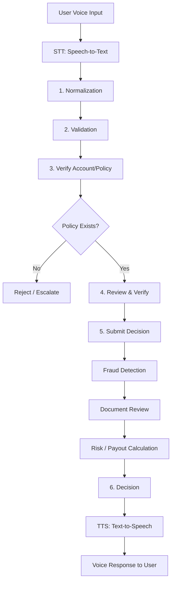

# Live Underwriter

**AI underwriting analyst agent team** — live, voice-driven risk assessment, policy verification, and decisioning.

> Automate the work of an underwriting analyst: gather applicant information, verify policy/account details, assess risk, and make accept/decline decisions — all through natural voice interaction.

## Why Live Underwriter?

Underwriting is a high-volume, decision-heavy job. `live_underwriter` turns it into an **agent team** that:

- 🎙️ **Talks to applicants** — live voice intake (speech-to-text) and voice responses (text-to-speech)
- 🔍 **Normalizes & validates** applicant data before any decision
- ✅ **Verifies** policy/account details against records
- 🧠 **Assesses risk** — fraud detection, document review, and payout/decision calculation
- 🤝 **Coordinates** multiple specialist agents through a stateful LangGraph workflow

## Architecture



### Agent Team

| Agent | Role |
|-------|------|
| **Voice Intake** | STT → text, TTS → voice response |
| **Normalization** | Clean & standardize applicant data |
| **Validation** | Check data completeness & format |
| **Policy Verification** | Verify account/policy exists |
| **Review** | Review & verify applicant details |
| **Fraud Detection** | Flag suspicious applications |
| **Document Review** | Analyze supporting documents |
| **Risk / Decision** | Calculate risk & underwriting decision |

## Quickstart

> This project uses [`uv`](https://docs.astral.sh/uv/) as its package manager.

```bash
# 1. Clone
git clone https://github.com/ai-shakti/live_underwriter.git
cd live_underwriter

# 2. Install dependencies (creates .venv + uv.lock)
uv sync --extra dev

# 3. Set your OpenAI key
export OPENAI_API_KEY="sk-..."

# 4. Run the CLI
uv run live-underwriter

# 5. Run tests
uv run python -m pytest
```

> **Note for pyenv users:** if `uv run pytest` resolves to the wrong Python
> (a pyenv shim conflict), invoke pytest as a module instead:
> `uv run python -m pytest`.

## Project Structure

```
live_underwriter/
├── src/live_underwriter/
│   ├── graph.py          # LangGraph state machine
│   ├── state.py          # Underwriting state schema
│   ├── agents/           # Specialist agents
│   ├── tools/            # Underwriting tools
│   └── cli.py            # CLI entry point
├── tests/
├── docs/
└── examples/
```

## Roadmap

- [ ] Core underwriting pipeline (normalize → validate → verify → review → decide)
- [ ] Fraud detection agent
- [ ] Document review agent
- [ ] Risk / decision calculation
- [ ] Voice layer (STT/TTS)
- [ ] Human-in-the-loop review for flagged cases

## License

[MIT](LICENSE) © 2026 Shakti Prasad Mohapatra

