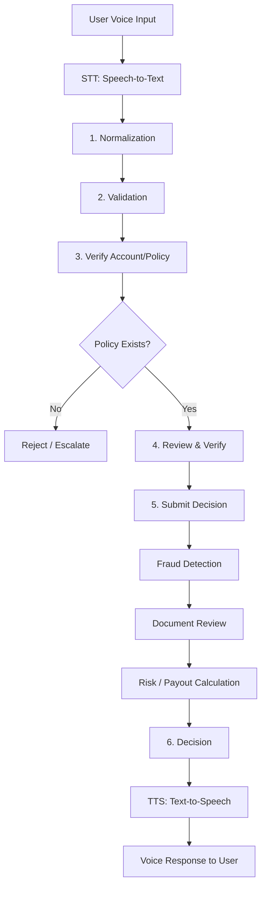

# Live Underwriter

**AI underwriting analyst agent team** — live, voice-driven risk assessment, policy verification, and decisioning.

> Automate the work of an underwriting analyst: gather applicant information, verify policy/account details, assess risk, and make accept/decline decisions — all through natural voice interaction.

## Why Live Underwriter?

Underwriting is a high-volume, decision-heavy job. `live_underwriter` turns it into an **agent team** that:

- 🎙️ **Talks to applicants** — live voice intake (speech-to-text) and voice responses (text-to-speech)
- 🔍 **Normalizes & validates** applicant data before any decision
- ✅ **Verifies** policy/account details against records
- 🧠 **Assesses risk** — fraud detection, document review, and payout/decision calculation
- 🤝 **Coordinates** multiple specialist agents through a stateful LangGraph workflow

## Architecture



### Agent Team

| Agent | Role |
|-------|------|
| **Voice Intake** | STT → text, TTS → voice response |
| **Normalization** | Clean & standardize applicant data |
| **Validation** | Check data completeness & format |
| **Policy Verification** | Verify account/policy exists |
| **Review** | Review & verify applicant details |
| **Fraud Detection** | Flag suspicious applications |
| **Document Review** | Analyze supporting documents |
| **Risk / Decision** | Calculate risk & underwriting decision |

## Quickstart

> This project uses [`uv`](https://docs.astral.sh/uv/) for the backend and
> [`npm`](https://www.npmjs.com/) for the frontend.

### Backend (Python / LangGraph / FastAPI)

```bash
cd backend
uv sync --extra dev

# Configure the LLM (Ollama / OpenAI-compatible). Copy the template:
cp .env.example .env
#   Then edit .env — set OLLAMA_MODEL (e.g. qwen2.5, qwen3, llama3.1),
#   OLLAMA_BASE_URL, and OLLAMA_API_KEY. See .env.example for all options.

# Run the CLI
uv run live-underwriter --seed-db
uv run live-underwriter --transcript "My name is Jane Doe, policy POL-1001, coverage 500000"

# Run the API server (http://localhost:8000)
uv run live-underwriter-api
# or: uv run python -m uvicorn live_underwriter.api:app --reload

# Run tests
uv run python -m pytest
```

### Frontend (Vite + React + Tailwind, light theme)

```bash
cd frontend
npm install
npm run dev        # http://localhost:5173 (proxies /api to :8000)
npm run build      # production build
```

### Live voice intake

The web UI has a **Record voice** button that captures audio from your
microphone, sends it to `POST /api/transcribe` (faster-whisper), and fills the
transcript box. To enable it, install the voice extras:

```bash
cd backend
uv sync --extra voice   # installs faster-whisper + kokoro
```

> **Note for pyenv users:** if `uv run pytest` resolves to the wrong Python
> (a pyenv shim conflict), invoke pytest as a module instead:
> `uv run python -m pytest`.

## Project Structure

```
live_underwriter/
├── backend/                     # Python / LangGraph / FastAPI
│   ├── src/live_underwriter/
│   │   ├── graph.py             # LangGraph state machine
│   │   ├── state.py             # Underwriting state schema
│   │   ├── agents/              # Specialist agents
│   │   ├── tools/               # Underwriting tools (STT/TTS)
│   │   ├── api.py               # FastAPI REST server
│   │   ├── api_server.py        # uvicorn entry point
│   │   ├── db.py                # SQLite repository + seed
│   │   ├── llm.py               # Ollama LLM wiring
│   │   └── cli.py               # CLI entry point
│   └── tests/
├── frontend/                    # Vite + React + Tailwind (light theme)
│   ├── src/
│   │   ├── App.tsx              # Main dashboard UI
│   │   ├── api.ts               # Backend API client
│   │   ├── types.ts             # Shared response types
│   │   └── index.css            # Tailwind + light theme
│   └── vite.config.ts           # Dev proxy /api -> :8000
├── docs/
└── examples/
```

## Roadmap

- [x] Core underwriting pipeline (normalize → validate → verify → review → decide)
- [x] Fraud detection agent
- [x] Document review agent
- [x] Risk / decision calculation
- [x] Voice layer (STT/TTS)
- [x] FastAPI REST backend
- [x] Vite + React + Tailwind frontend (light theme)
- [x] Live voice intake in the web UI (mic → STT → transcript)
- [ ] Human-in-the-loop review for flagged cases

## License

[MIT](LICENSE) © 2026 Shakti Prasad Mohapatra

